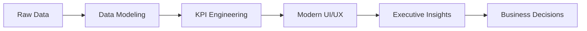

# ⚡ ADHAM ABDO — DATA ANALYTICS PORTFOLIO

<div align="center">


<br/>
<br/>

<p align="center">
  
</p>

<br/>

<p align="center">
  <a href="#-featured-projects">
    
  </a>
  <a href="#-tech-stack">
    
  </a>
  <a href="#-connect-with-me">
    
  </a>
</p>

</div>

---

# 🚀 ABOUT ME

```yaml
Name: Adham Abdo
Role: Data Analyst & BI Developer
Focus:
  - Power BI Dashboards
  - Executive Reporting Systems
  - PMO Analytics
  - HR & Workforce Analytics
  - Supply Chain Intelligence
  - Saudi Government Dashboards

Mission:
  "Transform complex datasets into premium business experiences"
```

<br/>

<div align="center">

| ⚡ Specialization       | 📊 Focus Area         | 🎯 Goal                  |
| ---------------------- | --------------------- | ------------------------ |
| Power BI Development   | Executive Dashboards  | Decision Intelligence    |
| SQL & Data Modeling    | KPI Engineering       | Performance Optimization |
| UI/UX Dashboard Design | Modern Analytics      | Premium User Experience  |
| Python Analytics       | Automation & Insights | Smart Reporting          |

</div>

---

# 🧠 TECH STACK

<div align="center">

## 📊 Analytics & BI


<br/>


<br/><br/>

## 🎨 Design & Development


</div>

---

# 🌌 PORTFOLIO HIGHLIGHTS

<div align="center">

| 📈 Project                   | 🏢 Industry                | ⚡ Impact                |
| ---------------------------- | -------------------------- | ----------------------- |
| Army Sales Orders Analysis   | Defense & Logistics        | $24B Sales Analysis     |
| Saudi Labor Market Analytics | Government Analytics       | 188M+ Workforce Records |
| HR Attrition Intelligence    | HR Analytics               | Reduced Retention Risk  |
| SCADA Monitoring Dashboard   | Energy Sector              | Operational Visibility  |
| Recycling Revenue Analytics  | Municipality & Environment | SAR 2.73M Tracking      |
| Corporate L&D Performance    | Learning & Development     | 277K Training Hours     |

</div>

---

# 🎨 DESIGN PHILOSOPHY

<div align="center">



</div>

<br/>

## ✨ What Makes My Dashboards Different?

* ⚡ Premium modern UI inspired by enterprise consulting firms
* 📊 Executive-focused KPI storytelling
* 🎯 High-performance Power BI architecture
* 🌍 Arabic + English bilingual support
* 📱 Responsive mobile-first dashboard layouts
* 🚀 Interactive user experiences with advanced drill-through logic
* 🎨 Strong focus on visual hierarchy and usability

---

# 🖥️ FEATURED PROJECTS

## ⚔️ Army Sales & Supply Chain Intelligence

> An enterprise-scale Power BI analytics system analyzing **605K+ sales orders** and **658M ordered units**.

### 🔥 Highlights

* Advanced DAX calculations
* Profit center drill-throughs
* Executive KPI storytelling
* Supply chain performance monitoring
* Fulfillment gap analysis

---

## 🏛️ Saudi Workforce & Labor Market Dashboard

> National-level workforce analytics platform covering **188M+ records**.

### 🔥 Highlights

* Geospatial workforce analysis
* Saudization monitoring
* Occupational segmentation
* Demographic trend analysis
* Interactive regional intelligence

---

## 🧑‍💼 HR Attrition & Employee Intelligence

> Deep HR analytics project identifying turnover risks and workforce behavior patterns.

### 🔥 Highlights

* Employee segmentation
* Attrition risk modeling
* Manager tenure analysis
* Python-powered analytics
* Executive HR insights

---

# 📊 GITHUB STATS

<div align="center">


<br/>


</div>

---

# 🛠️ CURRENT FOCUS

```diff
+ Building premium Power BI dashboards
+ Developing Saudi-market PMO analytics systems
+ Creating enterprise KPI frameworks
+ Advanced Power BI mobile experiences
+ Interactive analytics storytelling
```

---

# 🌍 CONNECT WITH ME

<div align="center">

<a href="https://linkedin.com/">
  
</a>

<a href="mailto:your@email.com">
  
</a>

<a href="https://github.com/">
  
</a>

</div>

---

<div align="center">

## ⚡ "Data is only valuable when it drives decisions."

<br/>


</div>
